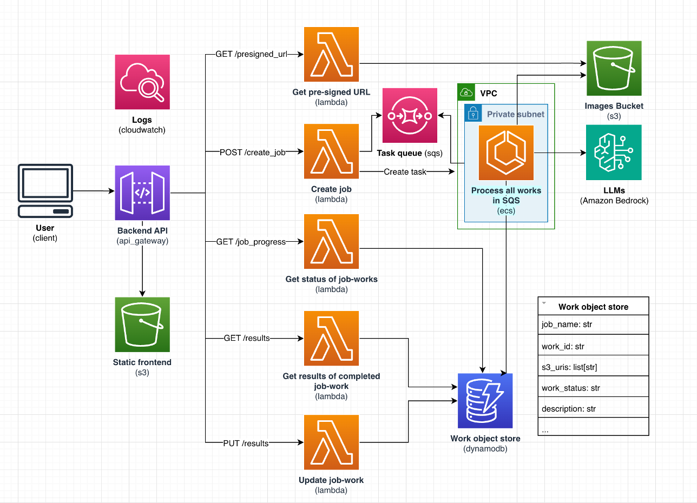

# Architecture

## Limitations

This solution was constrained by what services were allowed in our sandbox environment.

- Ideally, the frontend would be served behind Cloudfront, but it was a banned service. Instead, we're serving it directly using the API Gateway and grouping the backend endpoints within the `/api/` path.
- Ideally the application would be secured with a user and access management solution like Cognito, but it was a banned service. Involving Emory's interal tool was out-of-scope, so we secured the entire application using API Gateway's built in API Keys feature. This was not meant to be a long-term solution and we highly recommend integrating your preferred user and access management tool as soon as possible.
