# Workflow

## Step 1: User defines and communicates job request

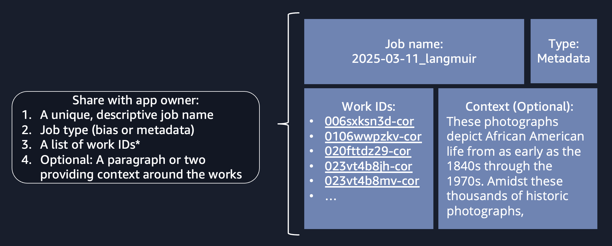

The application supports two types of jobs: Analyzing works for bias and generating metadata for works.

- Generating metadata only supports 1- and 2-page works and includes bias analysis as one of the fields.

- Bias analysis supports arbitrarily long works, but each page is processed independently.

The application is designed to use S3 URIs, whereas Emory employees think in terms of work IDs. Translating Emory's internal work IDs to URIs was out of scope, so kicking off jobs is, for now, a manual process dependent on a technical owner submitting a request directly to the backend. Linking work IDs to S3 URIs would be a great feature in the future to eliminate this manual step.

**NOTE:** Processing time is proportional to total page count. We'd recommend keeping jobs to a total page count under ~300. That could be 150 2-page works or 1 300-page book.


## Step 2: Create job

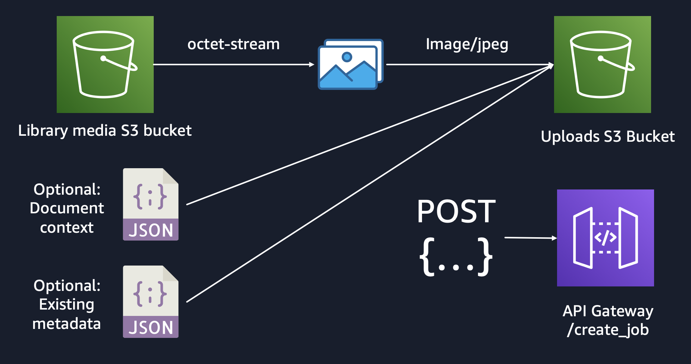
This is the manual step, for now. Under each library is a `client/` folder with code for preparing jobs and submitting API requests. The `notebooks/` folder at the project root depicts working examples invoking the client functions.

**NOTE:** We had issues displaying the original works in the UI, so one of the steps when creating works is to convert to JPEG.

### Request structure
```json
{
  "job_name" : "globally_unique",
  "job_type" : "job_type | metadata",
  "works": [
    {
      "work_id" : "001_normal",
      "image_s3_uris": ["s3://bucket/img.jpg", "s3://bucket/folder/"],
      "context_s3_uri": "s3://bucket/optional_context.txt",
      "original_metadata_s3_uri": "s3://bucket/optional_metadata.json",
    }
  ]
}
```
**Note:** `image_s3_uris` can be either an point to a specific file or just a folder - because SQS is limited to 2KB messages, we recommend using folders, especially when working with long works.

## Step 3: Log in

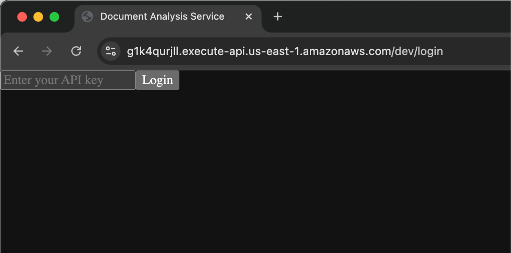

Because Cognito could not be used in our sandbox, we're using API Keys to authorize front and backend interactions. This was strictly a stopgap solution and we highly recommend integrating Emory's preferred identity and access management tool.

## Step 4: Search for job

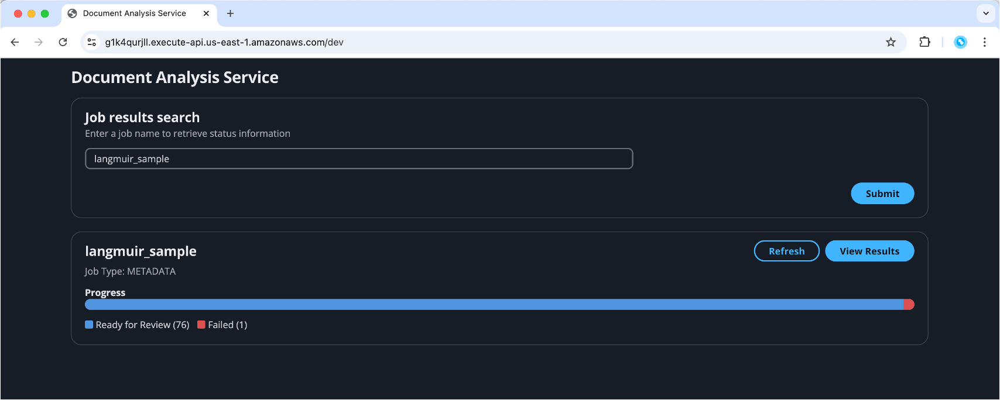

Whether you're searching for a bias or a metadata job, type the name in the search bar and you should find it.


## Step 5A: Review metadata job results

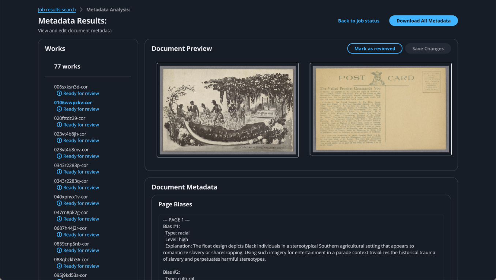

If the job was to generate metadata, you should a page like this. As works become ready for review, go through each field and verify it is satisfactory.

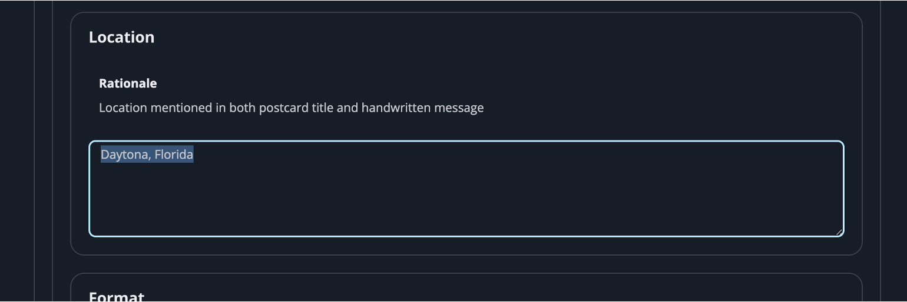

If not, modify the text, scroll back up, and hit "Save Changes".

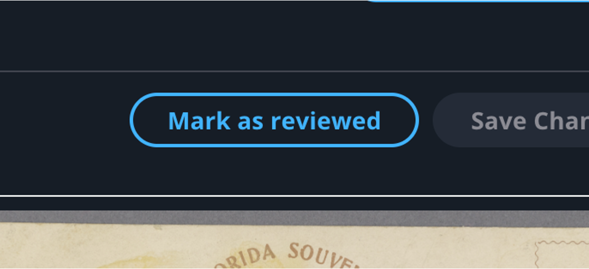

Once all fields have been reivewed, hit "Mark as reviewed".

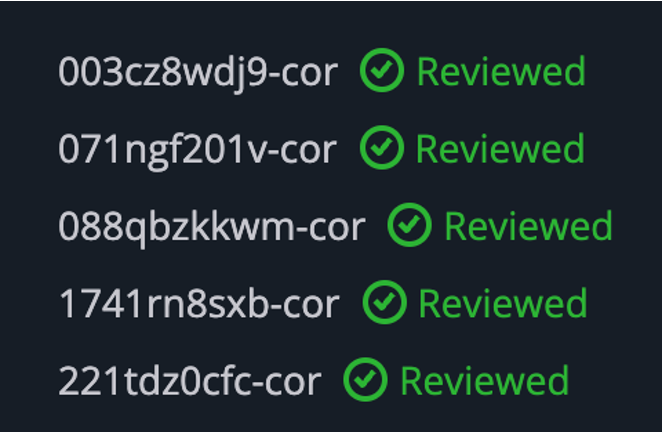

Once all works have been reviewed...

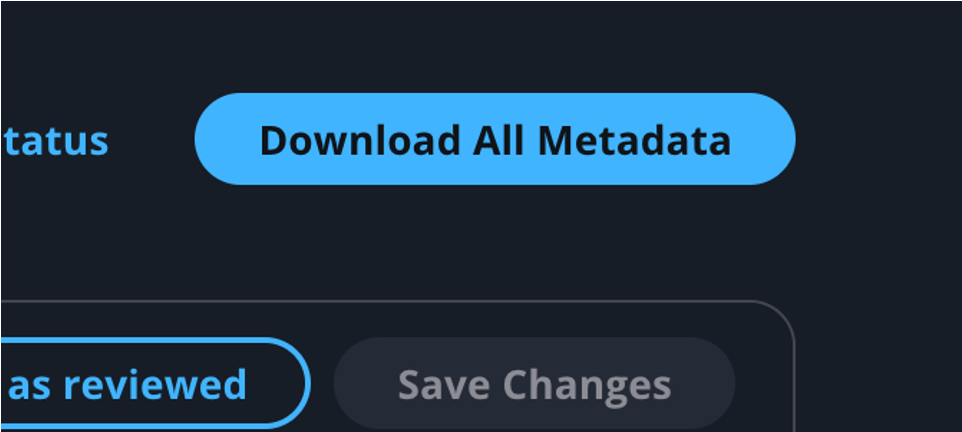

You can hit "Download All Metadata".

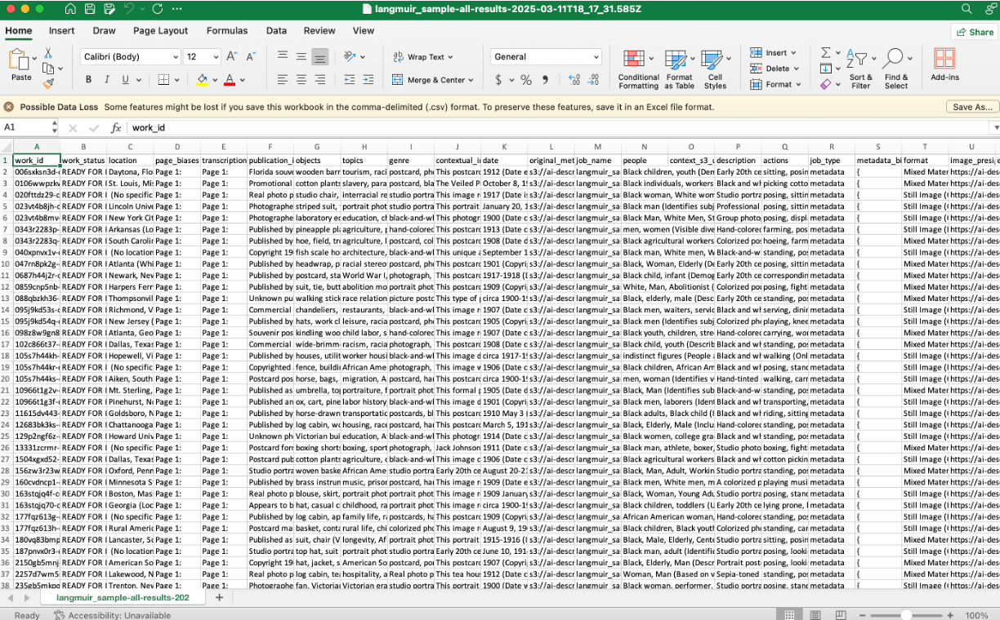

It'll download a spreadsheet like this.

## Step 5B: Review bias job results

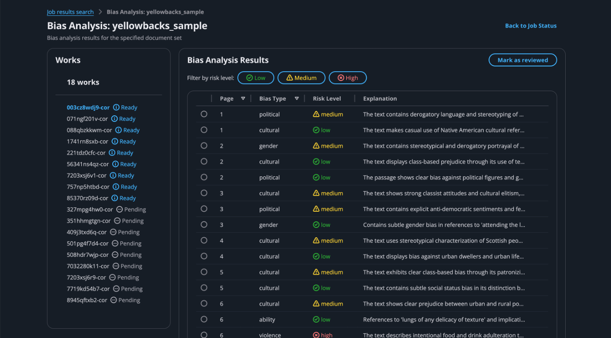

If your job was to analyze bias, you'll see a page like this. 

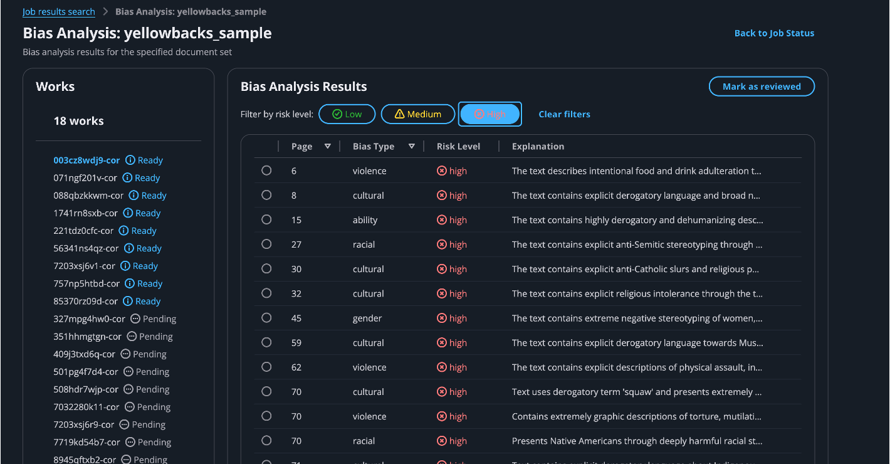

You can use the filters at the top to limit results to only the level of bias you're concerned with. We recommend focusing on high bias.

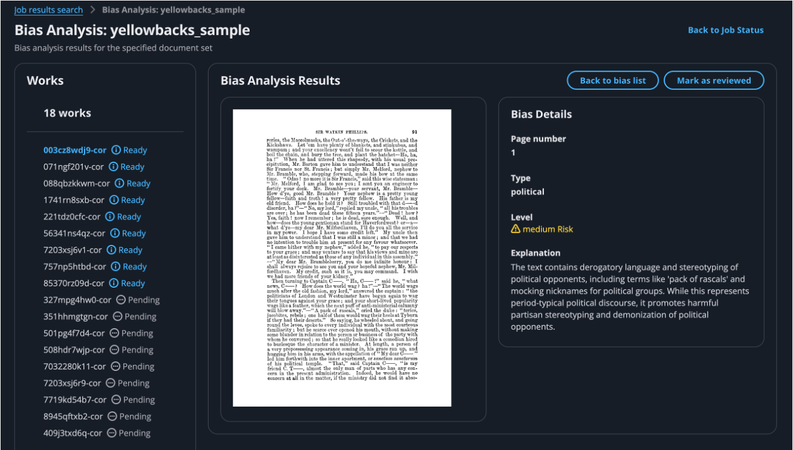

If you click into any of the examples, you'll see the page being flagged and a detailed explanation as to why it was flagged.
